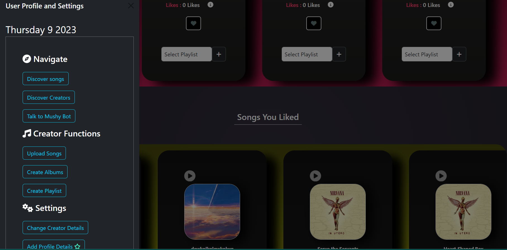
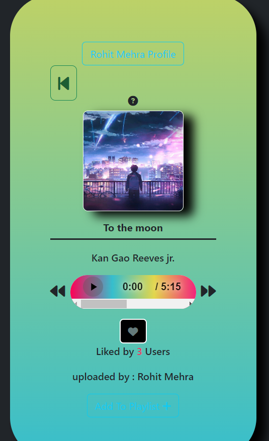
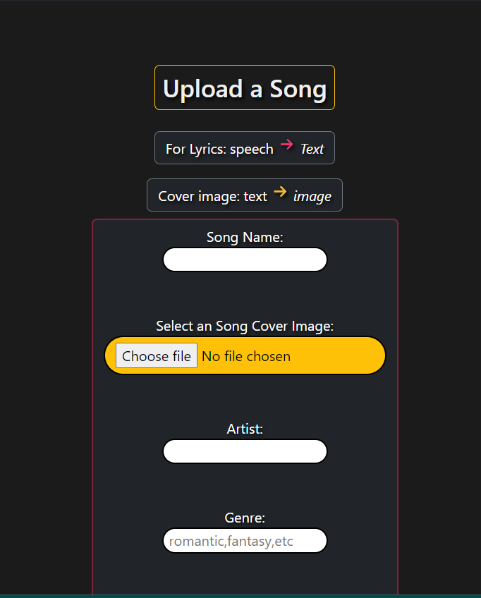
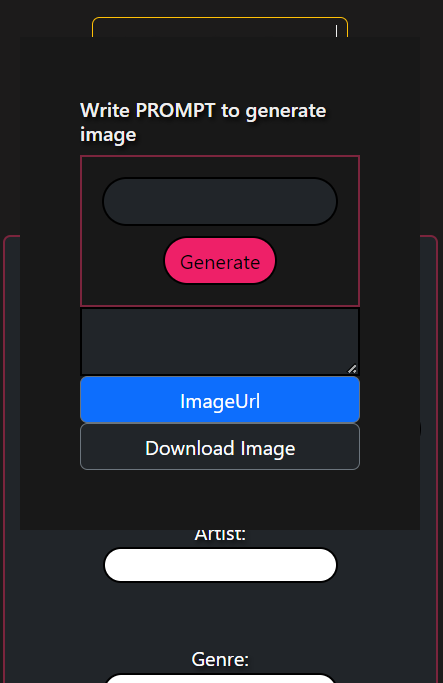
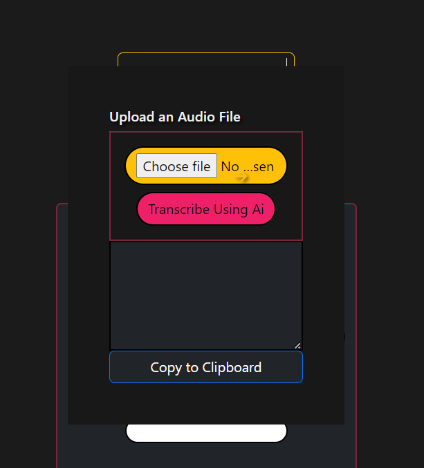
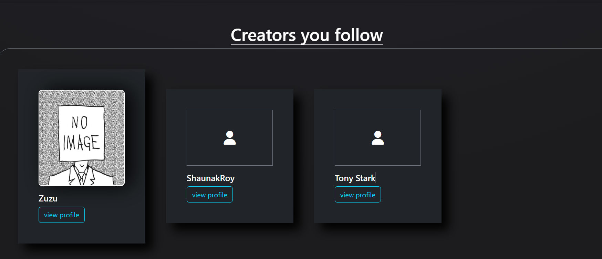
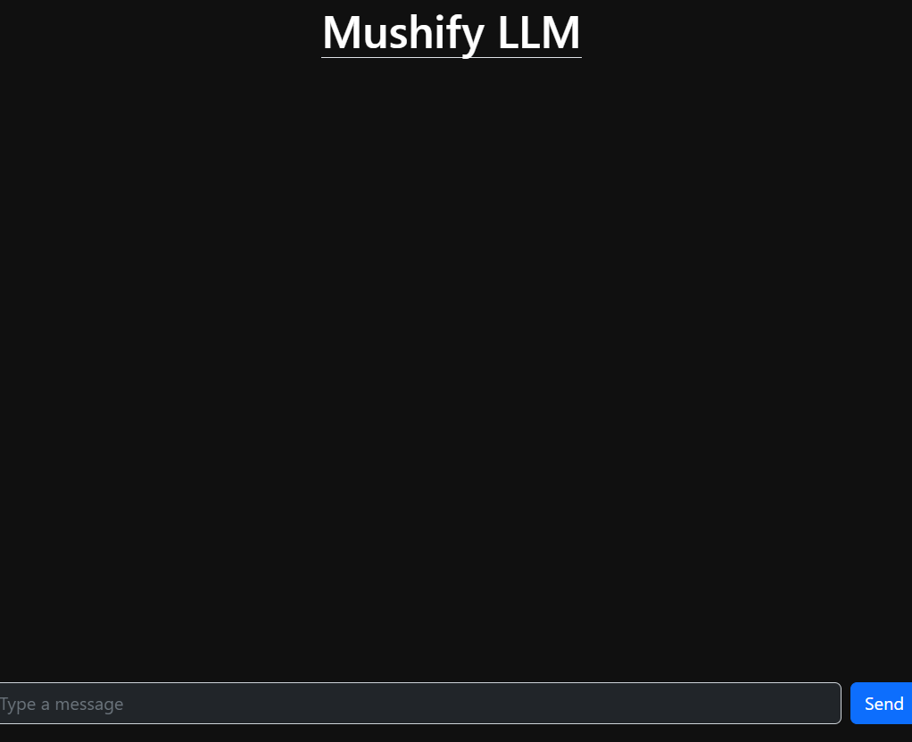

# **Mushify (Your Personal Music App)**


<div style="display: flex; justify-content: center; flex-wrap: nowrap; flex-direction:row">

  <!-- First row: First three images -->
  <div style="flex: 1; margin-right: 10px;">
    
  </div>
  <div style="flex: 1; margin-right: 10px;">
    
  </div>
  <div style="flex: 1;">
    
  </div>

  <!-- Second row: Rest of the images -->
 <div style="flex: 1; margin-top: 20px;">
    
  </div>
  <div style="flex: 1; margin-top: 20px;">
    
  </div>
  <div style="flex: 1; margin-top: 20px;">
    
  </div>
  <div style="flex: 1; margin-top: 20px;">
    
  </div>

</div>


## Overview

Mushify is an innovative music application built using Flask for the backend, with a frontend developed from scratch using Bootstrap and vanilla JavaScript. This application offers a seamless music experience with a variety of features designed for both users and creators, comparable to popular platforms like Spotify.

## Features

- **Music Uploads**: Easily upload and manage your music tracks.
- **Payment System**: Secure and efficient payment processing for subscriptions and purchases.
- **User Plans**: Flexible user plans including free, premium, and creator options.
- **AI Features**:
  - Text Extraction from Audio: Automatically extracts text from uploaded audio files.
  - Video Thumbnail Generation: Creates custom video thumbnails using AI technology.
  - And more advanced AI capabilities.
- **Responsive Design**: Optimized for all devices with a mobile-first approach.
- **User Authentication**: Secure login and registration system.
- **Music Streaming**: High-quality music streaming for all users.
- **RAG Chatbot**: Integrated RAG (Retrieval-Augmented Generation) chatbot to answer all user queries.
- **Comprehensive Feature Set**: All essential features found in leading music platforms like Spotify.

## Getting Started

### Prerequisites

- Python 3.11
- Flask
- Bootstrap
- JavaScript (Vanilla)

### Installation

1. **Clone the repository**
   ```bash
   git clone https://github.com/yourusername/Mushify.git
   cd mushify
   ```

2. **Install dependencies**
   ```bash
   pip install -r requirements.txt
   ```

3. **Run the Flask application**
   ```bash
   flask run
   ```

4. **Open your browser**
   Navigate to `http://127.0.0.1:5000` to view the application.

## Project Structure

```
mushify/
│
├── website/
│   ├── assets/
│   ├── Database/
│   ├── static/
│   └── templates/
│
├── app.py
├── requirements.txt
├── README.md
└── ...
```

## Usage

- **Home Page**: Browse and search for music tracks.
- **Upload Music**: Creators can upload their music tracks from the upload page.
- **Subscription Plans**: Choose from different plans that suit your needs.
- **AI Features**: Access advanced AI features to enhance your music experience.
- **Chatbot**: Utilize the RAG chatbot for assistance with any queries or issues.

## Contributing

We welcome contributions! Please read our [Contributing Guidelines](CONTRIBUTING.md) for details on the code of conduct, and the process for submitting pull requests.

## License

This project is licensed under the MIT License. See the [LICENSE](LICENSE) file for details.

## Contact

For any inquiries or feedback, please contact us at mrpolymathematica@gmail.com.

---

Enjoy a unique music experience with Mushify!